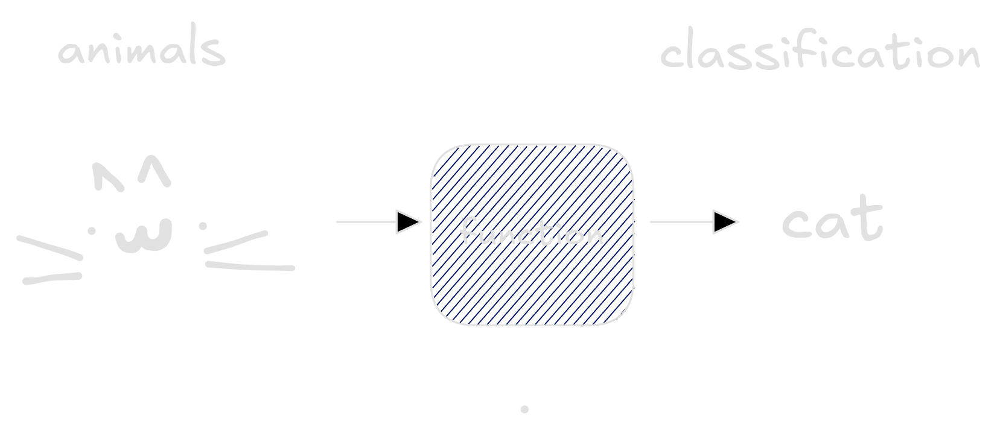
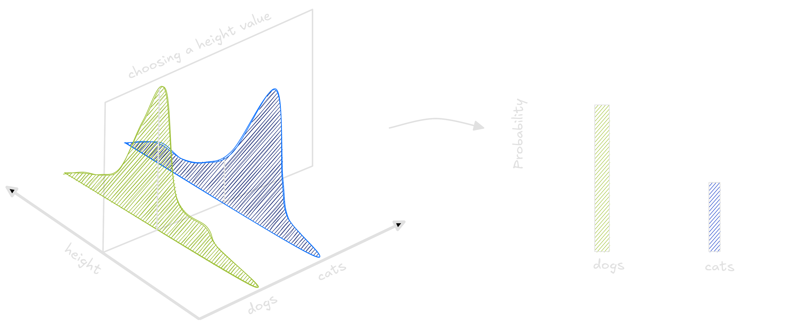

It's not easy to find equilibrium between complex and simple when training a Machine Learning model. This could be difference between a million dollars loss and huge win or between classifying your pets correctly. The explanations about Bias-Variance tradeoff never convinced me, so I decided explain my own way: what's really behind this dilemma?

Imagine everyday lots of dogs and cats pass through your window. Some of them are big, some are small ones. You decide to investigate wheter you could classify the pets using their heights and weights, so you take measures for a bunch of animals. Cats are usually smaller and lighter. Dogs are generally bigger or heavier. 

To classify these animals we can use Machine Learning. These models generalize from seeing some examples. Generalizing means that when presented a new animal, the model will be able to classify between cats and dogs. The same way a child see cats and learn what a cat is, computers see data and do the same. But choosing an model is not an easy task. We can use one line, lots of lines or even curves to separate dogs and cats.

The traced curves is trained on the dataset to classify every new point _below_ it as a cat, and every point _above_ it as a dog. The line does not separate all dogs and cats correctly while the squigle curve separate all dogs and cats correctly. Choosing the wrong model means it will not be able to generalize well on new animals. To compute how well the model generalizes we count it's errors on the data. The line has small error, while the curvy line performs poorly.

This task in Machine Learning is called classification, where the learned function output categories. 
The model itself is just a function which takes examples of the input space - dogs and cats information - and return labels `cat` and `dog` whether it is a cat or a dog respectively.

There exists lots of functions that receive an animal and return a {`cat`, `dog`} label. They can look like lines, curves or horrors behind our compreehension. We are searching for a good classifier, which can correctly distinguish between cats and dogs. Below I drew the space of all functions that take an animal and return a class. Each purple point in this space is a function.

To measure how good each function is, we input information of _all_ animals, compare with the labels and count how many times the function made a mistake. This measure is called the function risk. The bigger the risk, the worse the function is, so we are searching for a small risk function. 

That is a problem. To compute the risk we need all dogs and cats information. All pets that lived, those which are alive right now and the ones which are still not born. Poetic. An ideal model would have acess to all those informations in order to classify with precision whether a pet is a dog or a cat. But we cannot have such big dataset. Instead, we use a smaller one - some dogs and cats from our neighboorhood we measured.

The set of all pets hidden a probability function. We cannot see in more three dimensions, so to exemplify, consider only the size and class of the animals `cat` and `dog`. A point in the three dimensional graph has height, class and probability. It says which is the probability of finding a pet with this class (`cat` or `dog`) and this height. 

By selecting a height value in this distribution, we obtain another distribution which tells us exactly wheter an animal this tall has more chance of being a cat or a dog.

Unfortunately, we don't have acess to this distribution. If we had, no learning algorithm would be needed at all. And since we don't have all images nor the data distribution, we cannot compute the real risk. Our only option is to use our dataset, a set of samples from the real distribution, to compute an approximation of the true risk named _empirical risk_. 

Many functions exist - each with it's own risk. Of the many functions that exist, one has the smallest possible risk. This magical function is sometimes called Oracle. 

The Oracle is so good because it cheats. This function consult the probability distribution to classify an image. If the image has greater chance of being classified as dog, the Oracle classify as a dog. Otherwise, as a cat. No wonder why it is so good.

Our task as engineers and scientists is to get closer to the Oracle function as possible. Our best try is a function that lives happily in the space, trained using the avaliable dataset.

The space of functions that take pets and classify as cats or dogs is very diverse. Many functions - linear, quadratic, step functions, discontinuous and other ones - live there. Them all classify animals as cats and dogs.

A smaller circle inside this big space is called subspace, and it contains a smaller portion of all the functions. Some of these subspaces are bigger than the others. Take the quadratic space, a space where the quadratic functions live. Linear functions are a special case of quadratic functions where the quadratic term equals 0. Thus, the quadratic functions space also contains the linear functions space.

In Machine Learning, when choosing between Random Forests, Logistic Regressors or Neural Networks to classify a dataset, we also choose a subspace.
If we choose a linear model, like Logistic Regression, we will use a function that lies on the linear functions subspace. Choosing a class of functions means instead of looking through the whole space of functions that take animals as inputs and classify them, we will search over the subspace. 
It's a thought question to choose in which space our function will be estimated. 

We have no clue whether the Oracle function lives or not in the subspace. 
The only confidence is that one function in this subspace has the smallest risk.
Our objective during training, when the model learns to classify labels based on images from the dataset, is to estimate this smallest risk function. 
This smallest risk function is not the oracle, but it is also very good. 
The best we can do is learning a function that is close as possible to it using the avaliable dataset. 

Not only that, but we should understand how well functions in our subspace can be used to approximate any function in the whole space. Thus, we shall also minimize the distance between the best function in the subspace and the Oracle.

At this point we have a more precise view of the learning problem. There are functions that take animals images and return labels; we approximated each function true risk using the empirical risk. An ultimately good function, named Oracle, exists. And to learn we should choose a class of functions. We are asked again, what class of functions shall we use?

In on form or another, this problem has long worried engineers and scientists. This is the widely known problem in statistics entitled bias-variance trade-off. 

If we choose to separate classes using a line, every relation we ever find would be linear. But this would not come from data. Instead, it will be a bias imposed by us.
A good example of a small subspace is the space of Linear functions. In our example, choosing a reduced subspace is similar to tracing a line to classify dogs and cats. 
It will have high risk, making some mistakes and will not correctly separate the animals. 

A small space means the distance between the better function we can achieve and the Oracle will be very big.
Eventhough, it's easier to find a good estimation for the function inside the subspace since it's too small.

Conversely, if we choose a very curvy line to separate each dataset, we would always be able to separate pets from the dataset correctly. 
The model, though, would be subject to large fluctuations, depending on how accurate our dataset represent the real world.

A large subspace implies the distance between the better function we can achieve and the Oracle will be small (the oracle might even be in the subspace).
Although, if the subspace is too large, our model would be susceptible to changes in the dataset used for training.
We could find a function with big risk, small risk, medium risk: the model would suffer from large variance. 

In Machine Learning, it's common to explain this duality using the terms underfitting and overfitting. When the model suffers with high variance, we say it overfitted. Elseway, models with high bias suffer from underfitting.
The ideal model - the one with lowest risk - lies somewhere between those two worlds.

To classify correctly the pets in our dataset, a quadratic function would be ideal. Not simple as a line, nor too complicated as the high degree polynomial. 

Thus, we find the perfectly equilibrated subspace to estimate our function. But the journey of a scientist does not stop with quadratic functions. The toolbox of a good one should include regularizers.
