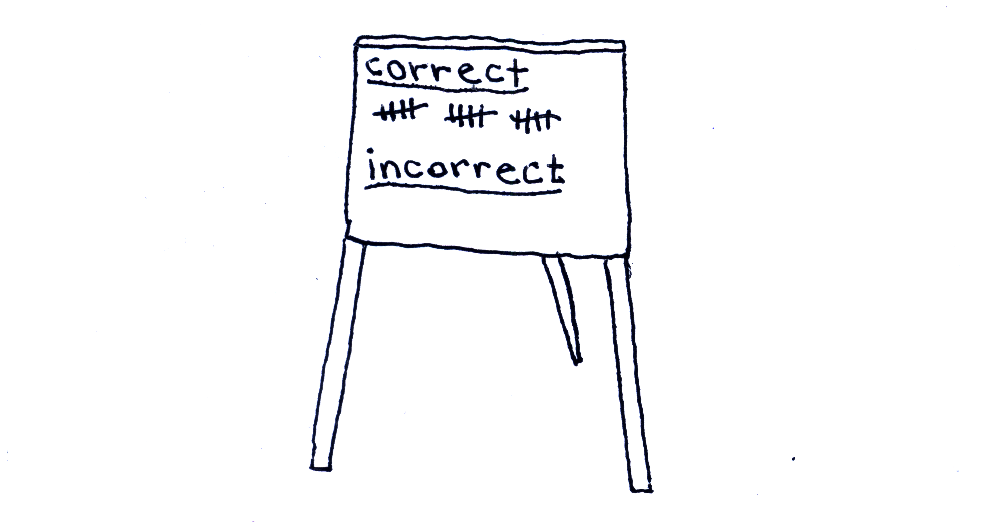
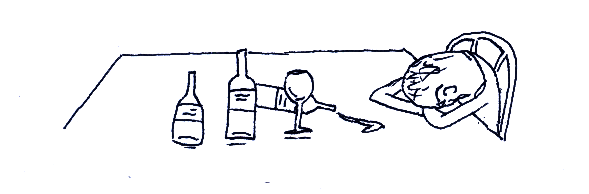
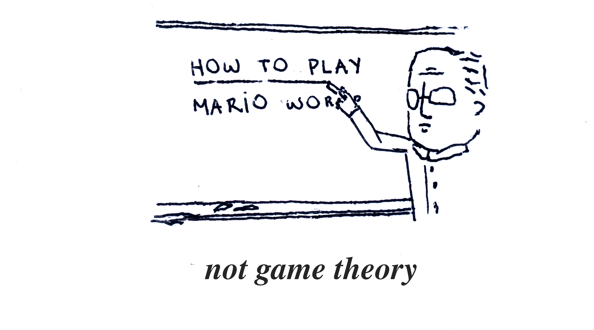

A life without questioning is not worth living. As Socrates famously put it, the history of humanity is the history of questioning. From physics to biology, from culinary arts to mathematics and even to computation. In the century of Artificial Intelligence, we ask: how do Machine Learning models work?

Recently, Harvard Medical School researchers demonstrated that AI can be used to [identify cancer in patient pathology images](https://hms.harvard.edu/news/new-artificial-intelligence-tool-cancer). This is a huge advance which can impact millions of lives. But these models often act like a black box, making it practically impossible to fully understand their outputs. 
Although, accuracy alone isn't enough. If clinicians can't understand why an AI flags a malignancy, they can't effectively fight it – the situation becomes a shot in the dark.

The operation of a model is determined by its parameters, which are its very essence and heart. These parameters are configurations, learned from data during training, that influence everything from how a Large Language Model (LLM) will answer your question, to how climate will be impacted by El Niño, or how an image might help identify a patient's Parkinson's condition. As of June 2025, OpenAI's latest model, GPT-4o, has around 12 billion parameters. Trying to understand each one is like counting grains of sand on a beach.

Even faced against the monstrous number of parameters in modern models, scientists didn't disappoint; a whole new field emerged to study and comprehend the outputs of AI models. 
Explainable AI (or XAI, for short) is a study area that aims to demystify AI systems, providing users insights into how they make their decisions. This does not mean XAI will explain every parameter in the model, but instead it provides context on why we got a particular output.

## The Explainable Wine 

Let's take a detour from learning machines for a minute and grab a glass of wine. At the winery we meet the a misterious Sommelier, which has legendary palate. He identifies any wine origin with inhuman accuracy. 

We hand him a glass of wine. He swirls, sniffs, sips and states: "Chile". Another glass earns "Swiss". Then, "Argentina". "France". Flawless, glass after glass, the Sommelier correctly classfify the wines. How did the Sommelier acquired such bohemian ability? Which subtle notes were most important for the veredict? 

Curious, we decide to investigate his answer. We bring a new bottle of wine with oak, berries and subtle honey sweetness. Shortly, he answers: "Portugal". 

Was it the hint of oak, the whisper of berries, or the gentle acidity? We bring a careful selection of similar wines to investigate his techniques and understand the final result. 
A pattern emerges! After one more round of perfect answers through the world's best wines, it's possible to deduce which notes were most important for classifying that glass as Portugal.

The sommelier classifies all wines with a oak tone as Portuguese - this appears to be an important feature for identifying Portuguese wines. Conversely, having a berries or honey touch doesn't affect the final result much. Similarly, that subtle sweetness have no impact whatsoever on the sommelier's judgment. These features are not that important.

After taking a sip of that explainable wine, we are ready to tackle a more complex problem.

## Uncovering the Black Box

Machine Learning models have millions - even billions - of parameters. Luckily, we dont need to decipher them all to understand a model's output.

The misterious sommelier we met in the last section acts like a black box model - high accuracy, but we have absolutely no idea of what's happening inside it. The handed wine glasses are the inputs, and their precise answers - Portugal, Chile, France - are the outputs. In real-world, an input might be a huge text or an image composed of millions of pixels. Like a wine's notes, some features in the inputs have a deep influence on the final result. Meanwhile, other have no influence whatsoever.

Those slightly altered versions of the Portuguese wine - berries with honey, berries with oak, berries alone, etc - form a new dataset. Since there are many possible altered versions, we randomly select some. In this dataset, wines that are very similar to the original bottle are given a bigger weight and the most different ones receive a smaller weight (this weight comes handy later!). 

To effectively quantify the sommelier logic for the Portugal bottle, we don't open the black box. Instead, we train a really simple model - preferably one we can actually understand, like linear regression - on this new weighted dataset (I told the weights would be useful; but we are not done yet!). Dataset samples with higher weights are more significative for the simple model. 

This simple model assigns a real coefficient value to each wine tone. A positive coefficient means that tone is directly correlated with the sommelier designation, while a negative coefficient means it's inversely correlated. Moreover, a big coefficient value means that particular tone had a signficant important for that specific wine.

These values are easy to read and interpret, offering explanations on what's behind the black box decision. This is the main idea behind Local Interpretable Model-Agnostic Explanations (LIME). But as notes in a chord, wine features doesn't act alone: they interact and blend in a tricky way.

## The Contribution Problem

We've become quite adept at nudging the Sommelier with slightly altered wines to see what tips their scales towards "Portugal" for a specific bottle. Oak notes gets the credit for that classification. 

But assigning fair credit is far more complex. Features in machine learning models, don't just add up; their influence changes depending on the company they keep. 
This dynamic interplay means we can't simply isolate one note's effect, making it incredibly difficult to know which feature truly deserves the credit for the Sommelier's judgment.

Consider a bottle of a fine Chilean wine, known for velvety or berries notes - the Sommelier easily identifies it. To understand the decision, we create a dataset and train a simpler model. Surprisingly, we obtain different results according to each dataset, because the features are redundant. Sometimes, it identifies velvety as an significant feature and berries are not important, while other times the game turns around.

Our explanation, while helpful for one specific bottle, becomes misleading when the wine's composition shifts even slightly.

The need for explanations with theoretical certainty becomes even more relevant for critical decisions. Take medical diagnosis or financial decisions for example.
Specifically, we want the credit attributed to each wine's notes to be consistent and accurate.
Consistency means that a note's importance won't surprisingly decrease if it always helps the Sommelier judgment. On the other hand, accuracy means the individual contributions sum up to the final veredict - pretty much like a formula: $\text{Portugal = oak - berries}$. Without those assurances, our insights might prove fragile despite convincing when truly tested.

## Giving Due Credit 

The contribution problem have a brilliant solution [worth a Nobel Prize](https://www.nobelprize.org/prizes/economic-sciences/2012/shapley/facts/). Shapley values are a concept from game theory, which became the gold standard for fair credit attribution. While LIME's sample's weight attribution is based on similarity, the main ideia is to weight new samples differently to obtain a feature credit attribution that is both accurate and consistent. 

How can a note contribute to the Sommelier result? Take Oak, for example. Its impact isn't straightforward. The list of combinations is extensive: Oak with Berries, Oak with Honey, Berries alone, etc. It's impossible to compute them all. moreover, simply looking at isolated cases isn't enough to understand a note's contribution.

Lloyd Shapley noted that we learn most about individual features contribution if we study their effects in isolation. If the sample consists of a wine with a single Oak note, we can learn about the Oak isolated effect on the Sommelier result. On the other hand, if the sample consists of a wine with all notes except Oak, we can learn how the absence effect. Finally, if the sample consists of half the amount of notes, we learn little about individual feature's contribution, as there are many combinations with that amount of notes. 

By averaging its impact across all such scenarios, Shapley values fairly distributes the credit for the Sommelier answer. This robust mathematical approach ensures that the resulting explanation satisfies crucial guarantees of accuracy and consistency we discussed. 

## An Empty Bottle 

We emptied some bottles and left the winery a little tipsy, but full of answers.

The journey on the explainable wines and the misterious Sommelier culminate in the Shapley values approach for understanding black-box models. Shapley values are widely used today through SHAP (SHapley Additive exPlanations), a Python library that uses the game theory approach for explaining Machine Learning models, providing consistent and accurate insights into their decisions. 

Even with the tools available, the need for explanations still torture humans. While AI models can make incredibly powerful predictions, the reasons behind a cancer diagnosis or a climate catastrophe prediction often remain a mystery. This is why Explainable AI is so important. Tools like SHAP help us take a look inside these systems and understand their judgments.
