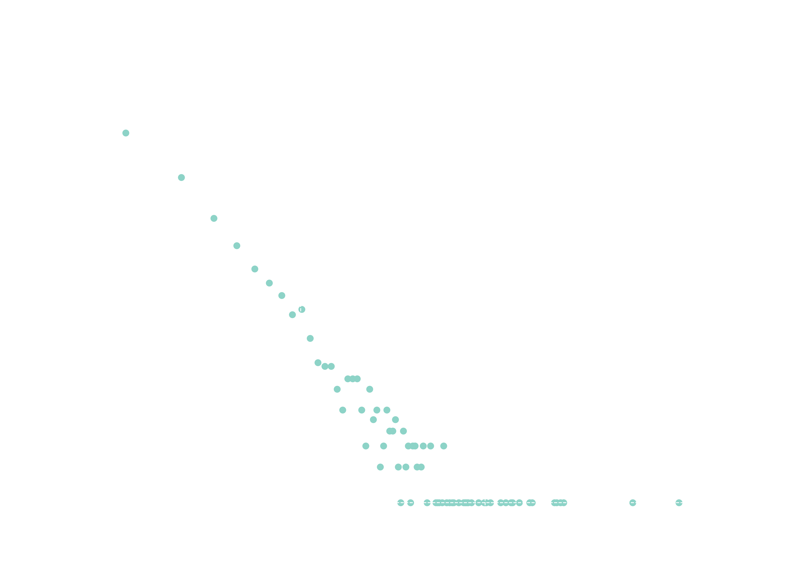
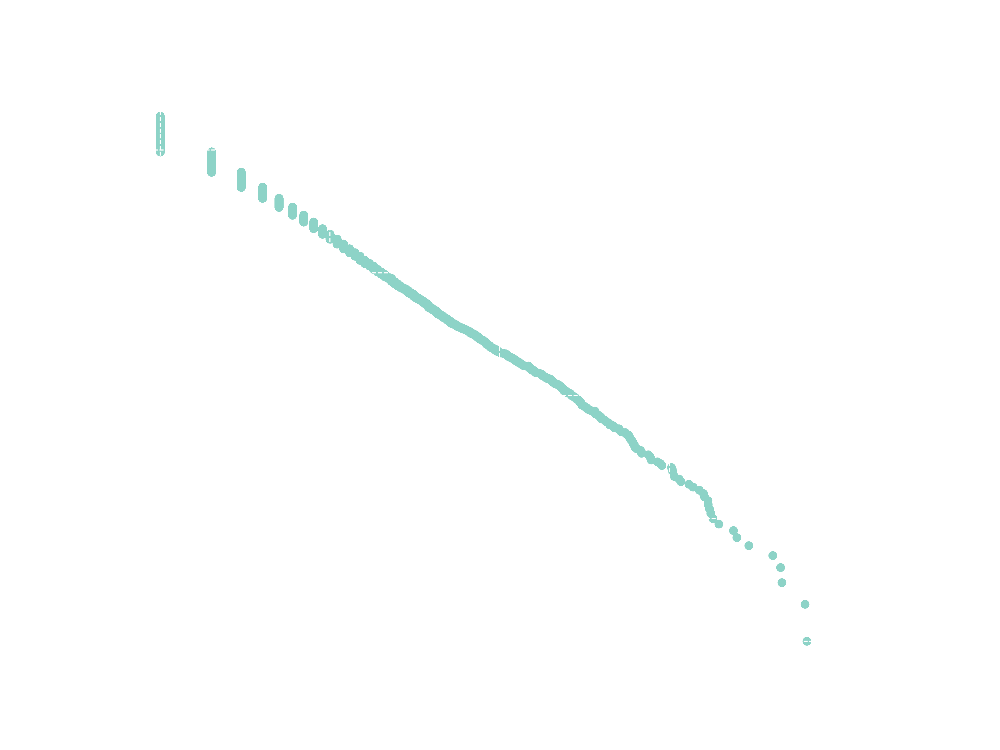
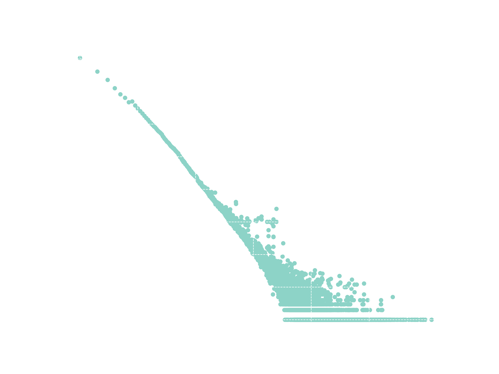
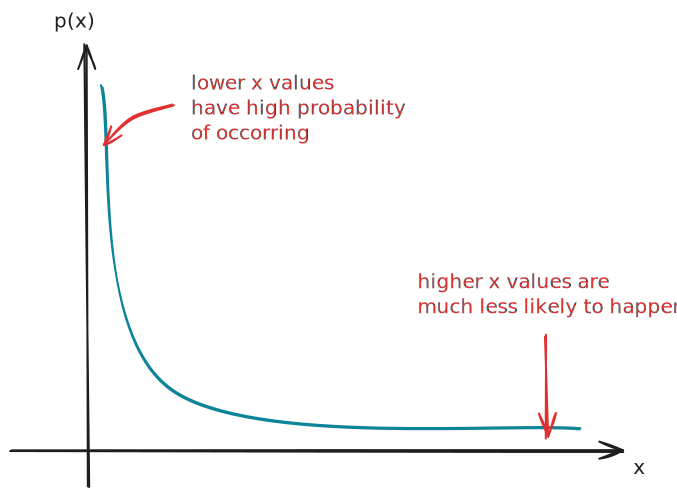
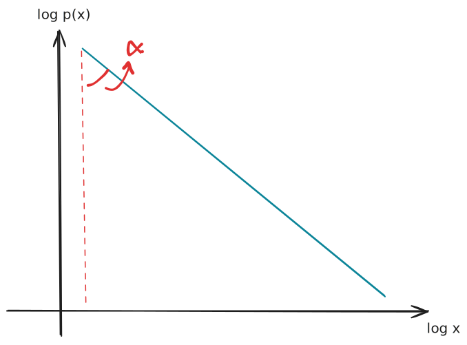
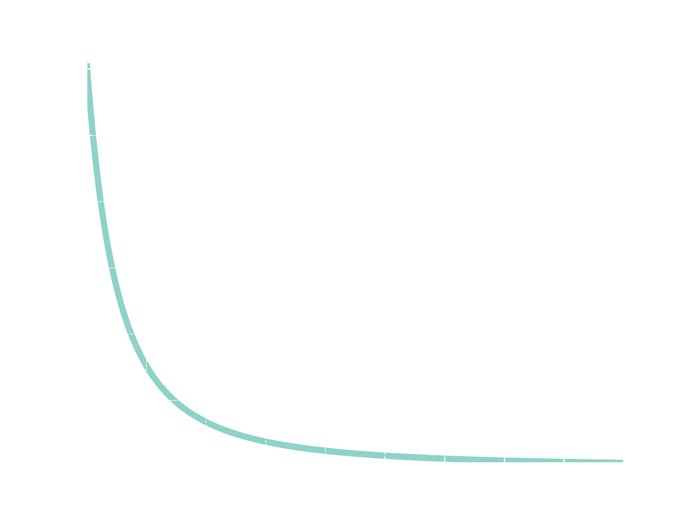
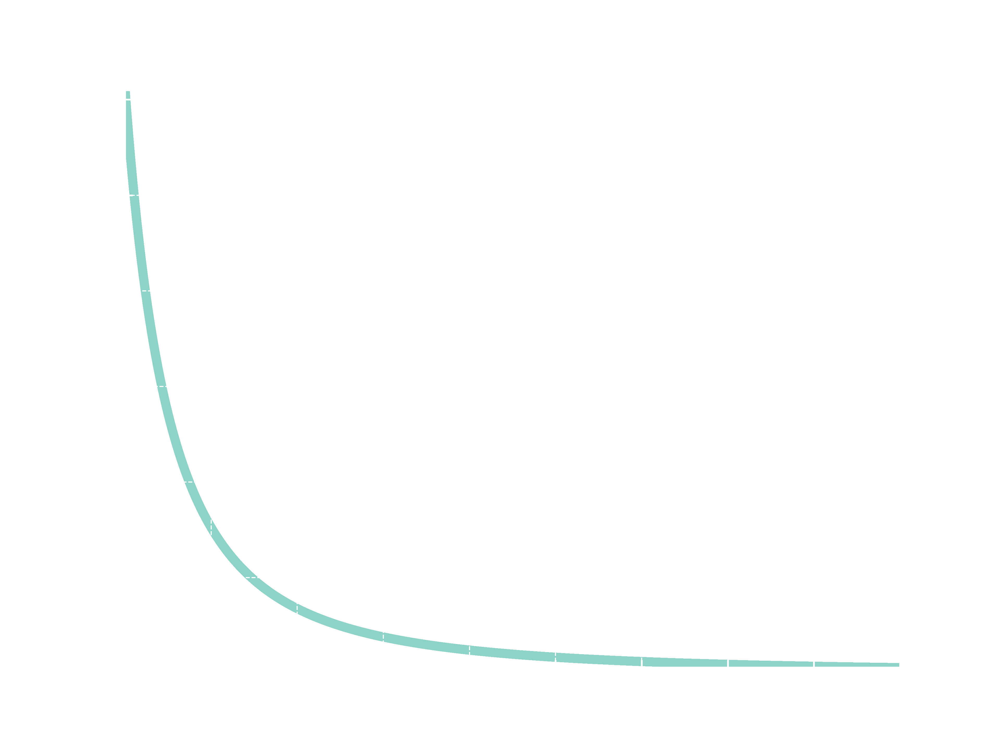
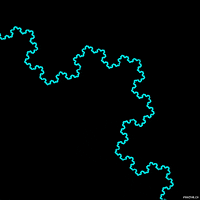

# This isn't Normal
Most of the quantities we deal with daily are well defined around a mean value. A simple example is the height of human beings. I would guess the average brazilian adult have 1.70m. Even if I miss the exact value, I still have a good idea of how tall people are in general, and I'm pretty sure I will not see anyone 30cm or 500km tall because as far as I know people height follows a *Normal distribution*. 


But not all things we measure are centered around a mean value. Some vary over an enourmous dynamic range, sometimes orders of magnitude. A famous example of this behaviour is the sizes of towns and cities in Brazil. I was born in the state of Minas Gerais, which has an incredible number of 853 cities. With a population of around 20 million people, it is correct to imagine that it **does not** have cities with around $2\times 10^7 / 853 \approx 23000$ habitants. Instead, Minas Gerais have some big cities, but most of them are really small. The pattern repeats when zooming out and analyzing the brazilian distribution and it is very different from what we saw in the last graph.


Additionally, it is important to notice that distributions with this kind of behaviour can be plotted with logarithmic horizontal and vertical axes. A remarkable pattern emerges: a straight line appears. 



Distributions of this form follow a Power Law, which are the central theme of this post. The objective is to introduce Power Laws and convince you how Universal they are. 

# An introduction to Universality
I remember very clearly the day I entered room 4-005 a couple of minutes late, sat at the back and started to listen professor Rodrigues talking about a thing called Universality. But wasn't he supposed to talk about networks? *"Anyway"*, he continued, *"the properties I'll show today are shared between a wide range of systems, from biological systems to the society. These organizations all have a thing in common: Power Laws."*

Wow! This is really amazing. Imagine having a unique law to rule them all. 

*"A really famous example involving Power Laws is the Protein Interaction Networks, where proteins interact with each other (of course!) in a way that a small fraction of proteins have a high number of interactions, while most of the proteins have a small number of interactions. In a similar manner, when we look to the topology of social networks like Twitter or Instagram we see a small proportion of influencers and famous people which got thousands or even millions of followers, at the same time that most of the users have a bunch of followers. Altough these systems are really different, they exhibit extraordinarily close behaviour."*

I never imagined that proteins could be related to Twitter like this. The examples professor Rodrigues talked about in class aren't just a coincidence. They suggest that exists some kind of **universal** underlying process in those systems!

*"Until now the text we discussed how universal power laws are. These organizations are present in physical, biological, technological and society systems of all kinds."* He then proceeded to show the two histograms I bring below.

### Word Frequency
*"The most famous example of the power law appears at the Zipf distributions, which states that the frequency words appear in a text are inversely proportional to their rank. This histogram shows the distribution of words from the book Moby Dick."*



### Internet
Things started to get even more interesting here. *"We passed through cities, literature and now we are examinating the links pointing to certain websites on the Internet. There are certainly billions of links reaching the Google website and only hundreds for less important sites. When analyzing the distribution of links through the entire Internet, the same pattern appears."*



# Characterizing the Power Law

As the careful reader might have already noticed, the standard strategy of identifying power laws consists in plotting an histogram with logarithmic scale and checking if a straight descending line exists. This could be a poor approach if we want to be more precise, but it is good enough for us.

Rodrigues got a pair of chalks and drew the cartesian coordinates and a curve on the left side of the big blackboard. *"Let's take a look of a drawing of a power law and decrypt what is happening exactly. The possible $x$ values lies on the $x$ axis, while the associated $p(x)$ probabilities are on the $y$ axis. By looking at the drawing, it is possible to see that smaller values have a high probability, which quickly decreases to a point where high $x$ values have an extremely low probability."*



*"This graph has the form $p(x) = Cx ^{-\alpha}$, ruled by constants $\alpha$ and $c$ which defines rate of decrease and min value respectively."*

At this moment, almost like a foresight and before I could lift my hand, someone asked the question I was wondering about.

### *"Where does that straight line comes from?"*

*"The straight line appears when taking logarithm on both axis"*
$$
\log p(x) = \log (C x ^{-\alpha})
$$

I'm sure everyone remember logarithm properties. Next, Rodrigues wrote. 

$$
 \log p(x) = \log C - \alpha \log x
$$

*"And this is exactly a linear equation of the kind $y = b - ax$."*



### More properties

At the end of the class a group of five to six people gathered around the professor discussing extra topics, such as how Power Laws are scale-free. In the blackboard he wrote the distribution definition again:

$$
p(x) = Cx ^{-\alpha}
$$

*"Imagine that we replace the $x$ with $kx$, where $k$ is a constant."*

$$
p(kx) = k^{-\alpha} Cx ^{-\alpha} = k^{-\alpha} p(x)
$$

*"At the end, what we can see is that multiplying $x$ by a constant factor $k$ does not change the shape of the distribution. Instead, it only scale it differently."* We can visualize this by using Python. 

#### Code
```python {.numberLines}
def plot(function, x_min, x_max):
    y_values = []
    x_values = list(np.arange(x_min, x_max, 1e-3))
    for x in x_values:
        y_values.append(f(x))
    y_max, y_min = f(x_min), f(x_max)
    plt.xlim(x_min, x_max)
    plt.ylim(y_min, y_max)
    plt.scatter(x_values, y_values, marker='.', s=50)

f = lambda x: 0.61*(x**-2)
k = 10

plot(f, 1, 10)
plot(f, 1*k, 10*k)
```





"But not only that. Because of that self-similarity, Power Laws are related to Fractals." Shortly, Fractals are geometric objects that can be divided into smaller parts; each one of them is similar to the original object. "Fractals are self-similar, they repeat itself just like the scale-free distribution" 

{ width=200px, height=200px }


### Datasets
- [Brazilian Cities](https://www.kaggle.com/datasets/crisparada/brazilian-cities)
- [Web Links](from The number of links to web sites found in a 1997 web crawl of about 200 million web pages, represented as a simple histogram.)
- [Moby Dick words](https://aaronclauset.github.io/powerlaws/data/words.txt)
