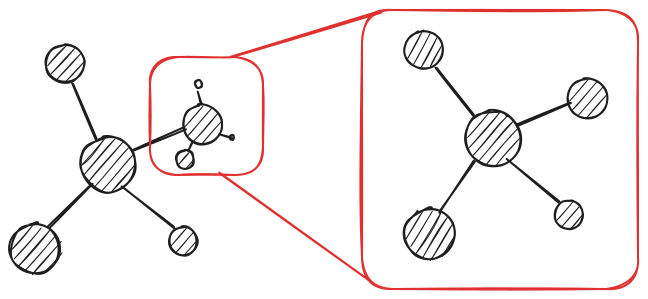

# This isn't Normal
Most of the quantities we deal with daily are well defined around a mean value. A simple example is the height of human beings. I would guess the average Brazilian adult has 1.70m. Even if I miss the exact value, I still have a good idea of how tall people are in general, and I'm pretty sure I will not see anyone 30 cm or 500 km tall because as far as I know people height follows a *Normal distribution*. 


But not all things we measure are centered around a mean value. Some vary over an enormous dynamic range, sometimes orders of magnitude. A famous example of this behaviour is the sizes of towns and cities in Brazil. I was born in the state of Minas Gerais, which has an incredible number of 853 cities. With a population of around 20 million people, you might expect cities in Minas Gerais to average about $2\times 10^7 / 853 \approx 23000$ inhabitants. However, this isn't the case. Instead, the state has a few large cities and many very small ones. The pattern repeats when zooming out and analyzing the Brazilian distribution and it is very different from what we saw in the last graph.


Additionally, it's worth noting that distributions with this kind of behavior can be plotted with logarithmic horizontal and vertical axes. A striking pattern emerges: a straight line. 


Distributions of this form follow a Power Law, which are the central theme of this post. 

# An introduction to Power Laws
I remember very clearly the day I entered room 4-005 a couple of minutes late, sat at the back and started to listen professor Rodrigues talking about a thing called Universality. But wasn't he supposed to talk about networks? *"Anyway"*, he continued, *"the properties I'll show today are shared between a wide range of systems, from biological systems to the society. These organizations all have a thing in common: Power Laws."*

Wow! This is really amazing. Imagine having a unique law to rule them all. 

*"A really famous example involving Power Laws is the Protein Interaction Networks, where proteins interact with each other (of course!) in a way that a small fraction of proteins have a high number of interactions, while most of the proteins have a small number of interactions. In a similar manner, when we look to the topology of social networks like Twitter or Instagram we see a small proportion of influencers and famous people which got thousands or even millions of followers, at the same time that most of the users have a bunch of followers. Altough these systems are really different, they exhibit extraordinarily close behaviour."*

I never imagined that proteins could be related to Twitter like this. The examples professor Rodrigues talked about in class aren't just a coincidence. They suggest that exists some kind of relation between those systems!

*"So far, we've discussed how universal Power Laws are. These organizations are present in physical, biological, technological and social systems of all kinds."* He then proceeded to show the two histograms I bring below.

### Word Frequency
*"The most famous example of the Power Law appears at the Zipf distributions, which states that the frequency with which words appear in a text are inversely proportional to their rank. This histogram shows the distribution of words from the book Moby Dick."*


### Internet
Things started to get even more interesting here. *"We passed through cities, literature and now we are examining the links pointing to certain websites on the Internet. Billions of links points to Google website, while less prominent sites may only have hundreds. When analyzing the distribution of links through the entire Internet, the same pattern appears."*


# Characterizing the Power Law

As the careful reader might have already noticed, the standard strategy of identifying power laws consists of plotting a histogram with logarithmic scale and checking if a straight descending line exists. While this method isn't the most precise, it's sufficient for our purposes.

Rodrigues got a pair of chalks and drew the cartesian coordinates and a curve on the left side of the big blackboard. *"Let's take a look of a drawing of a power law and decrypt what is happening exactly. The possible $x$ values lies on the $x$ axis, while the associated $p(x)$ probabilities are on the $y$ axis. By looking at the drawing, it is possible to see that smaller values have a high probability, which quickly decreases to a point where high $x$ values have an extremely low probability."*


*"This graph has the form $p(x) = Cx ^{-\alpha}$, ruled by the value $\alpha$, which is called the exponent of the Power Law and define the rate of decrease."*

At this moment, almost like a foresight and before I could lift my hand, someone asked the question I was wondering about.

### *"Where does that straight line comes from?"*

*"The straight line appears when taking logarithm on both axis"*
$$
\log p(x) = \log (C x ^{-\alpha})
$$

I'm sure everyone remember logarithm properties. Next, Rodrigues wrote. 

$$
 \log p(x) = \log C - \alpha \log x
$$

*"And this is exactly a linear equation of the kind $y = b - ax$."*


# Zooming In
### Scale-free distributions, Fractals and Universality

In the end of the class, a group of five to six people gathered around the professor discussing extra topics, such as how Power Laws are scale-free. In the blackboard he wrote the distribution definition again:

$$
p(x) = Cx ^{-\alpha}
$$

*"Imagine that we replace $x$ with $kx$, where $k$ is a constant."*

$$
p(kx) = k^{-\alpha} Cx ^{-\alpha} = k^{-\alpha} p(x)
$$

*"At the end, what we can see is that multiplying $x$ by a constant factor $k$ does not change the shape of the distribution - it simply scales it differently."* 

We can visualize this using Python. The code below creates two graphs of a Power Law $p(x)=0.61x^{-2}$ with different scales.

#### Code
```python {.numberLines}
def plot(function, x_min, x_max):
    y_values = []
    x_values = list(np.arange(x_min, x_max, 1e-3))
    for x in x_values:
        y_values.append(f(x))
    y_max, y_min = f(x_min), f(x_max)
    plt.xlim(x_min, x_max)
    plt.ylim(y_min, y_max)
    plt.scatter(x_values, y_values, marker='.', s=50)

f = lambda x: 0.61*(x**-2)
k = 10

plot(f, 1, 10)
plot(f, 1*k, 10*k)
```


*"But not only that."* Rodrigues resumed. *"Because of that self-similarity, Power Laws are related to Fractals. Fractals are self-similar and they repeat itself just like the scale-free distribution"*
 
If you live in a snowflake and never heard of fractals, they are geometric objects that can be divided into smaller parts; each one of them is similar to the original object. One shape is made of little shapes, that is made of little shapes, that... you got it!

{ width=200px, height=200px }

In the first we discussed how typical measures are centered around a mean value, like the human height. But what is the average size of a 'star' in the Koch curve above? Well, there are 'stars' of all different sizes, as we zoom in more 'stars' appears and that repeats infinitely.

*"If a system is characterized by a Power Law distribution, it surely has a fractality. Bringing to our class examples, we can think about fractality on the Instagram follower graph. A very famous person like Lionel Messi is followed by other famous people."* He grabbed the remaining piece of chalk and fastly draw a network using circles and arrows. *"When we scale down the graph and look at a smaller account, like Jesse's Teahouse (@jessesteahouse), it is followed by a smaller number of people, some of which are famous. If we scale down it and analyze my personal account, I am followed only by a bunch of friends and probabily not a single celebrity. This pattern of followers repeat all over the network."*



*"It does not means, altough, that all systems that have a Power Law distribution are formed by the same process. However, they are pretty useful because of universality. In Physics, the set of systems characterized by a Power Law can be classified according to universality classes, all of which has the same exponents independent of other parameters and can be shown to have the same fundamental dynamics. This why Power Laws are so important for us."*

It was a fascinating lesson. The professor said goodbye and left the room as we stared at the drawn network, thinking about Power Laws, universality and fractals. 

If you want to go deeper into the study of Power Laws you can check the references below.

## References
- [Power Laws, Pareto Distributions and Zipf's Law](https://arxiv.org/pdf/cond-mat/0412004)
- [Power Law: Universality in Nature](https://francisco-rodrigues.medium.com/power-law-universality-in-nature-c933f271bda8)
- [Complexity Explorer](https://www.youtube.com/@ComplexityExplorer)
- [Brazilian Cities Dataset](https://www.kaggle.com/datasets/crisparada/Brazilian-cities)
- [Web Links Dataset](from The number of links to web sites found in a 1997 web crawl of about 200 million web pages, represented as a simple histogram.)
- [Moby Dick words Dataset](https://aaronclauset.github.io/powerlaws/data/words.txt)
