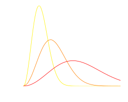

# Lecture I
Isolated measures of a closed system can be done, but it sometimes can have no utility. Imagine have the velocity of a particle in a room, an ambiente with tons of particles. In these cases, it is better to have statistical measures of a system. In this way, statistical mechanics can be applied to solids, gases and other.

## Basic Statistics
We are going to study things in certain states $i$. This way, the probability of a state can be defined as 
$$
\lim_{N \rightarrow \infty} \dfrac{N_i}{N_{total}}
$$

We can also specify the quantity associated with the state $i$ as $F(i)$. Thus, the average value of this measure $\langle F(i) \rangle$ is the summation over all possible state times the corresponding probability: $\sum_i F(i)P(i)$.

## Mechanics
### Symmetry
Is an important characteristic of these systems. If present, we may use statistical mechanics to uncover final states. Elseway, we should do by experimenting.

### Conservation of Energy
System law's can be represented as Markov Chains: you have a bunch of states and their transitions. More specifically, if the chain is irredutible, we can assure there is a conservation law. Else, there is loss of information. 

### Entropy
Entropy is measured over the number of states that has no null probability.
$$
S = \log M
$$
Where $M$ is the number of stationary states.

A more general entropy formula is given by 
$$
S = - \sum_i P(i) \log(P(i))
$$
**Example**: $n$ coins with equal probability (each coin can take two states) achieve $2^n$ possible states, and the total probability is $S=n \log 2$

## Boltzmann Distribution
The Boltzmann distribution is found by minimizing entropy with respect to some constraints. It describes a system in equilibrium.

$$
-S(P_i) = \sum_i \log P_i = F(P_i)
$$

with respect to 

$$
\sum_i P_i = 1 \text{ and } \sum_i P_iE_i = \langle E \rangle
$$

This is done using Lagrange Multipliers. Recover the $F$ above to write:
$$
F + \alpha(\sum_i P_i - 1) + \beta(\sum_i P_i E_i - \langle E \rangle) = F'(P_i)
$$

$$
\sum_i \log P_i + \alpha(\sum_i P_i - 1) + \beta(\sum_i P_i E_i - \langle E \rangle) = F'(P_i)
$$

For a specific $i$ we have $\frac{\partial F}{\partial P_i} = \log P_i + 1 + \alpha + \beta E_i$. Now we equal this to 0, obtaining

$$\log P_i + 1 + \alpha + \beta E_i = 0$$
$$\log P_i = -(1 + \alpha) - \beta E_i$$
$$P_i = e^{-(1+\alpha)}e^{-(\beta E_i)}$$
The value $z=e^{-(1+\alpha)}$ is called the partition function, and finally we obtain
$$P_i = \dfrac{e^{-\beta E_i}}{z}$$

We obtain a probability function where $z$ acts as a normalizing factor and $\beta$ has something you tune to change the average energy (below).

As the temperature increases (yellow to red), all states start to become equally probable.

#### Energy

We still have to discover unknown parameters. Lets use our constraints

$$
\sum_i P_i = \sum_i \dfrac{e^{-\beta E_i}}{z} \implies z(\beta) = e^{-\beta E_i}
$$

by differentiating $z$ with relation to $\beta$

$$\frac{\partial z}{\partial \beta} = - \sum_i E_i \dfrac{e^{-\beta E_i}}{z}=\langle E \rangle$$

So, it is possible to obtain the energy by deriving the partition function with respect to $\beta$: 

$$
E(\beta) = - \frac{\partial \log z}{\partial \beta}
$$

#### Beta
$$S = - \sum_i \dfrac{e^{-\beta E_i}}{z} [-\beta E_i - \log z] $$
thus
$$
S = \beta \langle E \rangle + \dfrac{\log z}{z}\sum_i e^{-\beta E_i} \implies S = \beta \langle E \rangle + \log z(\beta)
$$
Finally, deriving it gives
$$
dS = \beta dE + Ed\beta + \dfrac{\partial \log z}{\partial \beta} d\beta
$$
Last terms cancel out, giving
$$
dS = \beta dE \implies T = \dfrac{1}{\beta}
$$