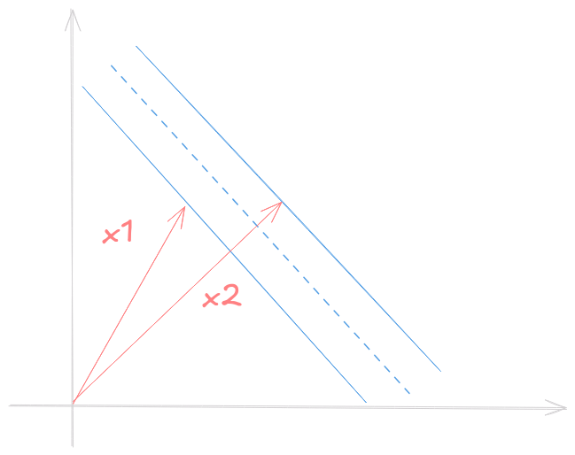
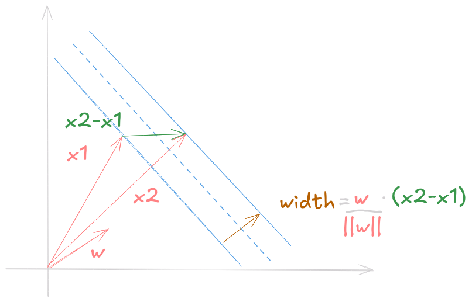

Support Vectors are definetly one of my favorite ideias in Machine Learning. It is such a simple concept, but when combined with some math, turns into a powerful tool. Vladimir Vapnik came with the ideia of Support Vectors in the middle of the 60's, but only in 1992 a group of scientists discovered a trick that could transform the linear model into a nonlinear one.

## Support Vector Machines
Suppose that two linear separable classes lies in a space. To create a model, we should find the best way to draw such a separation. Decision trees, neural networks came with theier own ideia, but Support Vector Machines (SVM) looks not for a line, but a lane that best does that separation.

That lane has two gutters in a way we want to maximize the distance between them.

### Decision Rule
Let $\vec{w}$ be a vector perpendicular to the lane and consider we want to classify an unknown example $\vec{u}$.
Our goal is to check if $\vec{u}$ belongs to the right or left side of the street. To achieve so, we should project $\vec{u}$ on $\vec{w}$

Thus, to classify $\vec{u}$ as class 1 or class 2, we should check if $\vec{w} \vec{u} \ge c$, where $c$ is a constant. Considering $c=-b$, we can finally write a decision rule:

> If $\vec{w} \vec{u} + b \ge 0$ then $\vec{u}$ belongs to class 1.

So good so far. But we still do not know which constant to use, so we can introduce some constraints and calculate $\vec{w}$ and $b$.
Consider $x_1$, $x_2$ a class 1 and 2 vector sample respectively. 
$$
\begin{equation}
\begin{cases}
    \vec{w} \vec{x_1} + b \ge 1 \\\
    \vec{w} \vec{x_2} + b \le 1
\end{cases}
\end{equation}
$$

For mathematical convenience we introduce $y$ such that 
$$
\begin{equation}
\begin{cases}
    x_1 \implies y_i = 1 \\\
    x_2 \implies y_i = -1
\end{cases}
\end{equation}
$$
Rewriting (1) with $y_1$ on both sides gives the same equation
$$
    y_i (\vec{w} \vec{x_i} + b) \ge 1 
$$

Notice that samples that lies on the gutters of the street have
$$
    y_i (\vec{w} \vec{x_i} + b) = 1
$$

## Calculating the widest lane

Knowing the equality for samples on the gutters, we can find the width of the lane by projecting the diff vector (difference between each class representant on the gutter) by normalized vector perpendicular to the lane.

The perpendicular vector we search for is $\dfrac{\vec{w}}{||\vec{w}||}$, and the diff is $(x_1 - x_2)$. Then, the lane width is given by $width = \dfrac{\vec{w}}{||\vec{w}||}(x_1 - x_2)$

Remembering (1) for samples on the gutters, we have 
$$
\begin{equation}
\begin{cases}
    \vec{x_1} = \dfrac{1 - b}{\vec{w}} \\\
    \vec{x_2} = - \dfrac{1 - b}{\vec{w}}
\end{cases}
\end{equation}
$$
Substituing on width formula
$$
    width = \dfrac{\vec{w}}{||\vec{w}||}(\dfrac{1 - b}{\vec{w}} + \dfrac{1 - b}{\vec{w}}) \\\
    width = \dfrac{2}{||\vec{w}||}
$$
We want to maximize the width, this is, we want to maximize $\dfrac{2}{||\vec{w}||}$. In a more convenient way, say that we want to minimize $\dfrac{1}{2}||\vec{w}||^2$.
Now we're half way there.

## Optimizing with the Lagrangian
In order to minimize $\dfrac{1}{2}||\vec{w}||^2$ with constraints $y_i (\vec{w} \vec{x_i} + b) - 1 \ge 0$ (those ensure each sample will be on the correct side of the lane) we can use Lagrangian Multipliers (what we should have learned in Calculus II).
The Lagrangian is an expression of the form $L(x, \lambda) = f(x) - \lambda g(x)$. And the maximum show up when we take the partial derivatives and equal them to 0. Let's see
$$
    L = \dfrac{1}{2}||\vec{w}||^2 - \sum_l a_i (y_i (\vec{x_i}\vec{w} + b) - 1) 
$$
We introduce multiplicative $\alpha s$ for each constraint. The summation iterates over the sample set $l$ and represents the function $g$. Note that $\frac{\partial ||\vec{w}||}{\partial \vec{w}} = \frac{\vec{w}}{||\vec{w}||}$ Taking the partials, we obtain
$$
\dfrac{\partial{L}}{\partial{\vec{w}}} = \vec{w} - \sum_l a_i y_i \vec{x_i} = 0 \implies \vec{w} = \sum_l a_i y_i \vec{x_i} \\\
\dfrac{\partial{L}}{\partial{b}} = \sum_l a_i y_i = 0
$$

Summarizing, we discovered that vector $\vec{w}$ is a linear combination of the samples. Going further, we can substitute the obtained expressions into $L$.
$$
L = \dfrac{1}{2}(\sum_l a_i y_i \vec{x_i}) (\sum_l a_j y_j \vec{x_j}) - (\sum_l a_i y_i \vec{x_i}) (\sum_l a_j y_j \vec{x_j}) + \sum_l a_i \\\
L = \sum_l a_i - \dfrac{1}{2}(\sum_l a_i a_j y_i y_j \vec{x_i} \vec{x_j})
$$

Finally! A analyst could be able to calculate the maximum of this expression, but most importantly, we discovered that **the optimization depends only on the dot product of pairs of samples** ($\vec{x_i} \vec{x_j}$). 

We can plug the obtained lane vector $\vec{w} = \sum_l a_i y_i \vec{x_i}$ to find a new decision rule:

> If $\sum_l a_i y_i \vec{x_i} \vec{u} + b \ge 0$ then $\vec{u}$ belongs to class 1.

In a similar way, the **decision rule also depends only on the dot product of the unknown vector and the samples vectors**.

**Note 1:** It is possible to prove that the Lagrangian gives a convex space, that is, the local maxima is also the global one.

**Note 2:** the constraints $\alpha_i \ne 0$ are going to be the ones related to samples that lie on the gutter of the street.

After all these calculations Vapnik certainly hesitated a little and think if he was going in the right direction. Only almost 30 years later, researchers found the ideia of a kernel, allowing the model to surpass linearity.

## Kernel
A general way to deal with linearity of a vector $\vec{u}: R^m$ is to create a function $\phi(x): R^m \rightarrow R^n$ with $n \ge m$ where the new coordinates $\phi(u)$ will be given by non-linear functions. This process can be very heavy to process, especially in numerous dimensions.

Altough, as seen in previous calculations, optimizing and classifying only need the result of $u\cdot v$ or $\phi(u)\cdot \phi(v)$. And there the Kernel Trick appears! *We do not need a $\phi$ function*, we just a function that gives the result of $\phi(u)\phi(v)$. This function is called the kernel function, and is represented by $k$.

$$
k(u,v)=\phi(u)\phi(v)
$$

### Polynomial Function (homogeneous)
The Polynomial Function gives the relation between two vectors in $n$ dimensions.
$$
k(u, v) = (u \cdot v)^n
$$
### Radial Basis Function Kernel
The Radial Basis Function (RBF), generalizes the Polynomial Kernel and gives the relation between these two vectors in infinite dimensions $k_{RBF}: R^m\rightarrow R^\infty$
$$
k(u,v)=\exp{(-\lambda ||\vec{u} \cdot \vec{v}||)}
$$

There are [lots of different kernels](https://github.com/gmum/pykernels) you can possibly test and use.

## Final SVM Formulation
Consider a sample set $x$, a kernel $k$. A new sample $\vec{u}$ is classified using
$$
\text{sgn}(\sum_l a_i y_i k(\vec{x_i}, \vec{u}) + b)
$$
where $\vec{\alpha}$ solves
$$
\begin{cases}
\text{argmax}_{\vec{\alpha}} 
\sum_l a_i - \dfrac{1}{2}(\sum_l a_i a_j y_i y_j k(\vec{x_i},\vec{x_j})) \newline
\sum_l a_i y_i = 0
\end{cases}
$$

### References
- [Patrick Winston Lecture on SVM](https://www.youtube.com/watch?v=_PwhiWxHK8o)
- [RBF kernel as a projection into infinite dimensions](https://pages.cs.wisc.edu/~matthewb/pages/notes/pdf/svms/RBFKernel.pdf)
- [SkLearn SVM](https://scikit-learn.org/stable/modules/svm.html)
- [PyKernels](https://github.com/gmum/pykernels)
- [The Kernel Cookbook](https://www.cs.toronto.edu/~duvenaud/cookbook/)
- [StatQuest on SVM](https://www.youtube.com/watch?v=efR1C6CvhmE&)
- [Smola's Tutorial on SVR](http://i2pc.es/coss/Docencia/SignalProcessingReviews/Smola2004.pdf)
- [Support Vector Regression Machines](https://proceedings.neurips.cc/paper_files/paper/1996/file/d38901788c533e8286cb6400b40b386d-Paper.pdf)
- [Vladimir Vapnik on Wikipedia](https://en.wikipedia.org/wiki/Vladimir_Vapnik)
- https://www.svms.org/