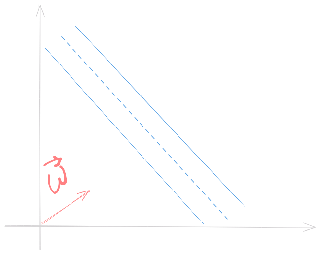
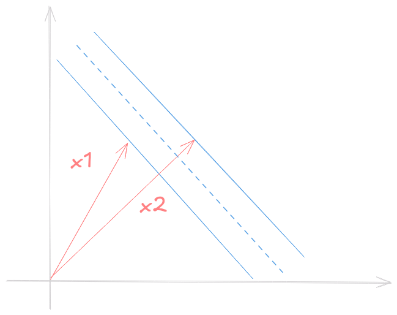

# Sumário 
- Support Vector Machines (SVMs)
- Kernel Trick
- Formulação Final
- Como pensar em Kernel de nós e Diffusion Kernel

# Support Vector Machines (SVMs)
Support Vector Machines são uma das minhas ideias favoritas no contexto de Aprendizado de Máquina. É um conceito muito simples que combinado com matemática, se torna uma ferramenta poderosa. O cientista soviético Vladimir Vapnik trouxe a ideia original nos anos 60 mas apenas em 1992, um grupo de cientistias foram capazes de encontrar um truque que transformasse o modelo linear em não linear.

Imagine duas classes separáveis que vivem em um espaço qualquer. Para criar um modelo, devemos encontrar a melhor maneira de separá-los. Enquanto Árvores de Decisão e Redes Neurais tem suas ideias, SVM buscam encontrar uma faixa que realize a melhor separação.

A faixa tem duas bordas e nós queremos maximizar a distância entre elas.

## Regra de Decisão
Considere $\vec{w}$ um vetor perpendicular a faixa e considere que queremos classificar um novo exemplo $\vec{u}$.
Nosso objetivo é checar se $\vec{u}$ pertence ao lado direito ou esquerdo da faixa. Para tanto, nós devemos projetar $\vec{u}$ em $\vec{w}$

Assim, para classificar $\vec{u}$ entre classe 1 ou 2, checamos se $\vec{w} \vec{u} \ge c$, onde $c$ is a constant. Considerando $c=-b$, podemos escrever uma regra de decisão:

> Se $\vec{w} \vec{u} + b \ge 0$ então $\vec{u}$ pertence a classe 1.

Ótimo! Mas ainda não sabemos qual valor usar, então devemos introduzir algumas restrições (constraints) a fim de calcular $\vec{w}$ e $b$.
Considere $x_1$, $x_2$ amostras de classe 1 e 2 respectivamente. Assim,
$$
\begin{cases}
    \vec{w} \vec{x_1} + b \ge 1 \\\
    \vec{w} \vec{x_2} + b \le 1
\end{cases}
$$

Para conveniência introduzimos $y$ de forma que 
$$
\begin{cases}
    x_1 \implies y_i = 1 \\\
    x_2 \implies y_i = -1
\end{cases}
$$
Assim reescrevemos (1) com $y_i$ dos dois lados:
$$
    y_i (\vec{w} \vec{x_i} + b) \ge 1 
$$
Note que amostras nas bordas da faixa tem
$$
    y_i (\vec{w} \vec{x_i} + b) = 1
$$

## Encontrando a faixa mais larga

Sabendo a equação para amostras nas bordas, podemos encontrar a largura da faixa ao projetar a diferença entre os representantes de cada classe nas boardas pela vetor perpendicular a faixa normalizado. 

O vetor perpendicular que buscamos é $\dfrac{\vec{w}}{||\vec{w}||}$ e a diferença $(x_1 - x_2)$. Portanto, a largura da faixa é dada por $\text{width} = \dfrac{\vec{w}}{||\vec{w}||}(x_1 - x_2)$.

Reescrevendo (1) para amostras nas bordas obtemos
$$
\begin{cases}
    \vec{x_1} = \dfrac{1 - b}{\vec{w}} \\\
    \vec{x_2} = - \dfrac{1 - b}{\vec{w}}
\end{cases}
$$

E substituindo na fórmula da largura
$$
    \text{width} = \dfrac{\vec{w}}{||\vec{w}||}(\dfrac{1 - b}{\vec{w}} + \dfrac{1 - b}{\vec{w}}) = \dfrac{2}{||\vec{w}||}
$$

Nós queremos maximizar a largura, isto é, maximizar $\dfrac{2}{||\vec{w}||}$. De forma mais conveniente, podemos minimizar $\dfrac{1}{2}||\vec{w}||^2$.

## Otimização com Multiplicadores de Lagrange
Para minimizar $\dfrac{1}{2}||\vec{w}||^2$ com as restrições $y_i (\vec{w} \vec{x_i} + b) - 1 \ge 0$ (as quais garantem que cada amostra estará do lado correto) podemos utilizar Multiplicadores de Lagrange.
O Lagrangiano é uma expressão da forma $L(x, \lambda) = f(x) - \lambda g(x)$. O valor mínimo é encontrado quando pegamos as derivadas parciais e igualamos a 0.
$$
    L = \dfrac{1}{2}||\vec{w}||^2 - \sum_l a_i (y_i (\vec{x_i}\vec{w} + b) - 1) 
$$
Introduzimos $\alpha s$ para cada amostra. A soma é realizada sobre o conjunto de amostras $l$. 

> Note que $\frac{\partial ||\vec{w}||}{\partial \vec{w}} = \frac{\vec{w}}{||\vec{w}||}$. 

Ao pegar as derivadas parciais obtemos
$$
\dfrac{\partial{L}}{\partial{\vec{w}}} = \vec{w} - \sum_l a_i y_i \vec{x_i} = 0 \implies \vec{w} = \sum_l a_i y_i \vec{x_i} \\\
\dfrac{\partial{L}}{\partial{b}} = \sum_l a_i y_i = 0
$$

Resumindo, encontramos que o vetor $\vec{w}$ é uma combinação linear das amostras. Podemos substituir as expressões obtidas em L para encontrar:

$$
L = \dfrac{1}{2}(\sum_l a_i y_i \vec{x_i}) (\sum_l a_j y_j \vec{x_j}) - (\sum_l a_i y_i \vec{x_i}) (\sum_l a_j y_j \vec{x_j}) + \sum_l a_i 
$$

$$
L = \sum_l a_i - \dfrac{1}{2}(\sum_l a_i a_j y_i y_j \vec{x_i} \vec{x_j})
$$

Finalmente! O mais importante aqui é descobrirmos que **a otimização depende apenas do produto escalar dos pares de amostras** ($\vec{x_i} \vec{x_j}$). 

Podemos inserir o vetor obtido para a faixa $\vec{w} = \sum_l a_i y_i \vec{x_i}$ para encontrar uma nova regra de decisão:

> Se $\sum_l a_i y_i \vec{x_i} \vec{u} + b \ge 0$ então $\vec{u}$ pertence a classe 1.

De forma similar, a **regra de decisão também depende apenas do produto escalar entre o vetor desconhecido e as amostras**.

**Nota 1**: é possível provar que o Lagrangiano pertence a um espaço convexo, e portanto, o máximo local também é global.

**Nota 2**: as amostras com $\alpha_i \ne 0$ serão aquelas nas bordas da faixa.

## Kernel
Uma forma comum para lidar com a linearidade de um vetor 
$\vec{u}: R^m$
é criar uma função 
$\phi(x): R^m \rightarrow R^n$ 
com $n \ge m$ em que as novas coordenadas $\phi(u)$ serão dadas por funções não lineares. Esse processo pode ser computacionalmente pesado, especialmente em altas dimensões.

Entretanto, como visto nos últimos parágrafos, para otimizar e classificar precisamos apenas do resultado de $u\cdot v$ ou $\phi(u)\cdot \phi(v)$. O Kernel Trick é que nós *não precisamos de uma função $\phi$*, apenas de uma função que calcule o resultado de $\phi(u)\phi(v)$. Essa função é o kernel, representado pela letra $k$.

$$
k(u,v)=\phi(u)\phi(v)
$$

### Kernel RBF

O Kernel Radial Basis Function (RBF), generaliza um kernel polinomial para gerar a [relação entre vetores num espaço de dimensão infinita](https://pages.cs.wisc.edu/~matthewb/pages/notes/pdf/svms/RBFKernel.pdf):
$$
k(u,v)=\exp{(-\lambda ||\vec{u} \cdot \vec{v}||)}
$$

## Formulação Final
Considere um conjunto de amostras $x$, um kernel $k$. Uma nova amostra $\vec{u}$ é classificada usando

$$
\text{sgn}(\sum_l a_i y_i k(\vec{x_i}, \vec{u}) + b)
$$

onde $\vec{\alpha}$ resolve

$$
\begin{cases}
\text{argmin}_{\vec{\alpha}} 
\sum_l a_i - \dfrac{1}{2}(\sum_l a_i a_j y_i y_j k(\vec{x_i},\vec{x_j})) \newline
\sum_l a_i y_i = 0
\end{cases}
$$

## Inferência em Grafos
Em ciência de dados, os dados podem estar estruturados como nós de um grafo e não como vetores. Isso pode acontecer naturalmente, pela discretização de um espaço contínuo ou por que é conveniente.

Para aplicar SVMs em grafos, é preciso encontrar um $k(u, v)$ entre os nós.

### Matriz de Adjacência
Não é um kernel válido :( Podemos encontrar vários problemas. Um exemplo muito claro é que nem todos vértices podem ser diretamente alcançáveis.

### Difusão em Grafos
Para resolver esse problema, utilizamos a difusão em grafos. A difusão é um processo amplamente conhecido na física e pode ser interpretado como o espalhamento de uma substância quando introduzido em um meio. 

Na versão para grafos, a difusão pode ser considerada como um RBF em grafos e representa caminhadas aleatórias em tempo contínuo. 
$$
K=\exp (\Delta)
$$

onde $\Delta$ é o Laplaciano da matriz de adjacência. 

### References
- [StatQuest on SVM](https://www.youtube.com/watch?v=efR1C6CvhmE&)
- [Patrick Winston Lecture on SVM](https://www.youtube.com/watch?v=_PwhiWxHK8o)
- [RBF kernel as a projection into infinite dimensions](https://pages.cs.wisc.edu/~matthewb/pages/notes/pdf/svms/RBFKernel.pdf)
- [The Kernel Cookbook](https://www.cs.toronto.edu/~duvenaud/cookbook/)
- [Inference on Graphs](https://members.cbio.mines-paristech.fr/~jvert/talks/040206insead/insead.pdf)
- [Diffusion Kernels](https://people.cs.uchicago.edu/~risi/papers/KondorVert04.pdf)