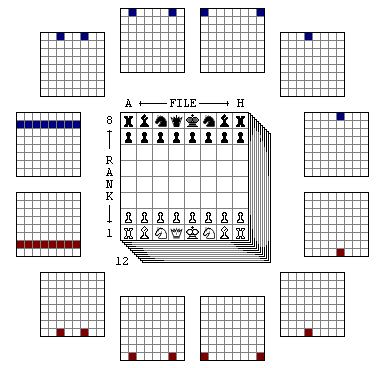

+++
title = "Creating a Chess Bot with Data Science"
date = "2023-12-25"
draft = false
slug = 'pyrarucu'
tags = ['Machine Learning', 'Artificial Inteligence', 'Chess', 'Bot']
headline = 'A story about chess bots and how I made mine'
readingtime = true
+++

Unite two passions like chess and computers is an old hobby that started long time ago when I created an website to agregate chess info around the net. There was a long time ago, and having the opportunity to make another project involving chess make me curious. 

The youtuber [Sebastian Lague](https://www.youtube.com/c/SebastianLague) developed a challenge between its followers with the objective of creating the most powerful Chess Bot within a limit of characters in C#. Together with some university colleagues, we created the [Saint Charles Bot](https://github.com/icmc-data/tiny-chess-bots) (named after our campus city).

But the bot did not work as expected. Fitting a Neural Network, our main goal, into the limit of 2048 tokens proposed by Sebastian turned out to be a pain. In the end, we sent a simple version of the bot just for fun. The story did not end there, tough. After the challenge, we trascribed the code to Python to create Pyrarucu. Its name is based on the powerful chess bots Rybka, Stockfish, which references fishes, with a touch of brasility. You can challenge it for a game at [Lichess](https://lichess.org/@/Pyrarucu).

In this post, I want to give a idea of the main challenges and tips of building a chess bot with machine learning.

#### Dataset
In this project I choosen to work with supervised learning techniques. The dataset [Chess Evaluations](https://www.kaggle.com/datasets/ronakbadhe/chess-evaluations) have millions of [FEN](https://en.wikipedia.org/wiki/Forsyth%E2%80%93Edwards_Notation) positions with theier respective analizys by a strong chess computer [Stockfish](https://stockfishchess.org/) which will work as training data for my Neural Network.

#### Bitboard
A bitboard is a very common way of storing bits in computer games, where each bit represents a piece or a space. In our case, the bitboard is a tool that helps produce a vector representation of the Chess board.

There are 12 different types of pieces in the game, including the white pawn, the white bishop, ... and the black king. Thus, each piece can receive its representation in bitboards, which is a vector of size 64 (there is a space for each square on the board) and receives the value 1 if the piece is located there and 0 otherwise.



#### Evaluation Function and Neural Network
Put it simple, an analysis function is a function that given an board state, returns a number that indicates the advantages of each side. If the value is positive, white pieces have an advantage and vice versa. 


Each entry of the dataset has an evaluation by Stockfish and we should create a network that better approximate its behaviour.

Initially, we transform the FEN positions in bitboards. With a vector of bitboards and respecitive evaluations, we can train a neural network and use it as our analysis function.

``` python
X = df['FEN'].apply(fen_to_bit_array).to_list()
y = df['Evaluation']
reg = MLPRegressor().fit(X, Y)
reg.predict(X_test)
```
``` bash
0.07698299
```

#### Search Function 
With the evaluation function in hands, we should find a way of making the better move. To do so, we create a tree, where the root node is the current position and each edge is a move that leads to a different position.


This way, we should search for the move that maximizes our advantage and minimizes the opponent. The algorithm that makes this search is called MinMax. Pyrarucu uses a improved version of MinMax that cuts from tree moves according to a lower and upper bound in a way that with less nodes to search, it runs faster. 

With these steps, we have a functional bot that receives a board state and replies with the best move. *Or at least his best move*. You can see the full code to [Pyrarucu at Github](https://github.com/icmc-data/Pyrarucu/). If you are interested in coding chess bots, I encourage you to take a look at [Chess Programming Wiki](https://www.chessprogramming.org/Main_Page), a repository of knowledge about everything we know about chess computer. 

### References
1. [Stanford CS221](https://stanford.edu/~cpiech/cs221/apps/deepBlue.html)
2. [Coding Adventure: Making a Better Chess Bot](https://www.youtube.com/watch?v=_vqlIPDR2TU)